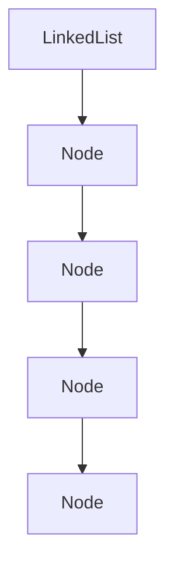

# Overview

Provides a *simple linked list* implementation in Python. You can use this implementation as
a foundational reference for the best practices you can use throughout the course.

This sample includes some features of Python that you do **not** need to demonstrate
but nevertheless are good to know.

For example:
- The use of generics in 3.12 syntax (and do note that this syntax is not valid in earlier Python versions)
- The use of generators (`yield` keyword) and the implementation of the linked list as an `__iter__` (with or without `__next__')

The linked list is implemented as a singly linked list, with a `Node` class and a `LinkedList` class.

As shown in the following figure, the linked list provides an entry point to the head node and methods (abstractions) for adding and removing nodes from head


**Figure 1.** Linked list structure

## Setting up

Create and activate a virtual environment:

```bash
python -m venv .venv
source .venv/bin/activate
```

Install the dependencies outlined in the makefile:

```bash
make install_requirements
```

## Running the tests

Most of the key commands you need to run have been incorporated in the included `Makefile`.

```bash
make test
make mypy
make lint
```
